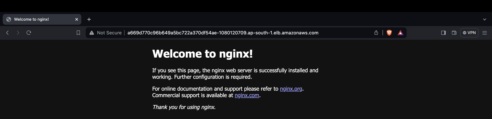
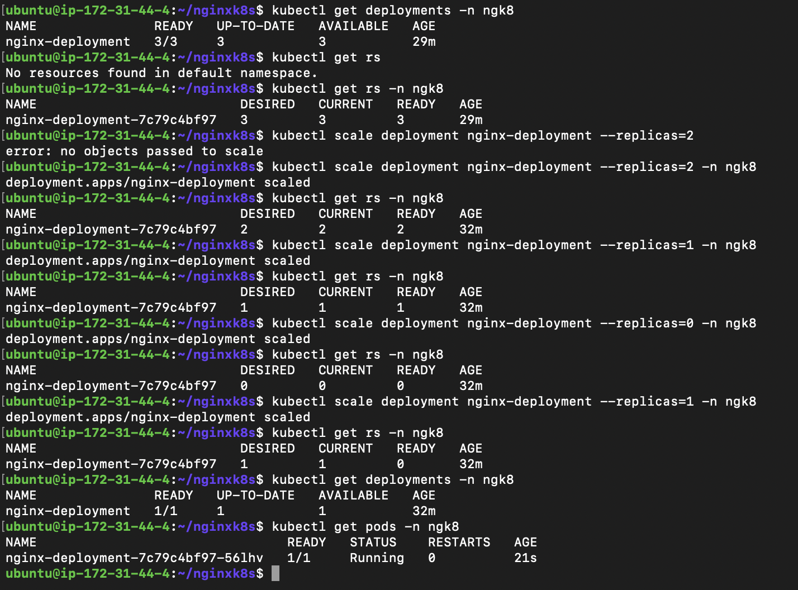
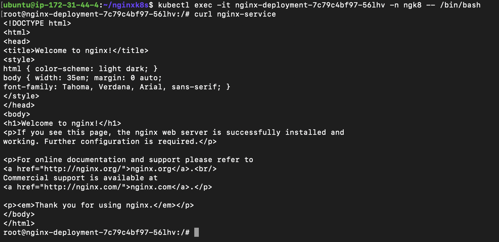
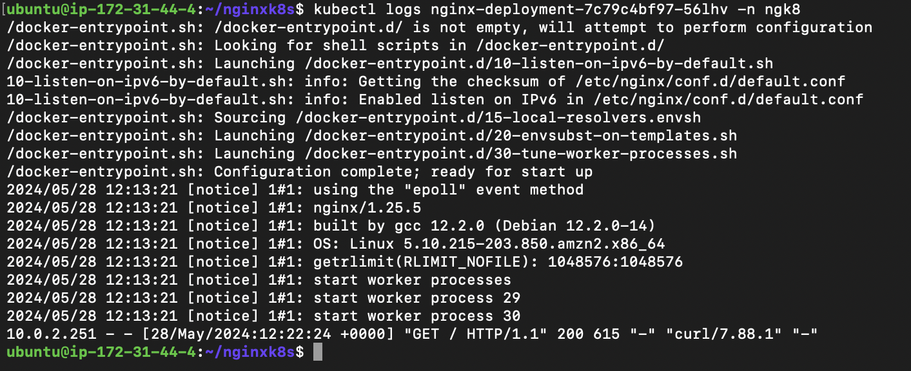
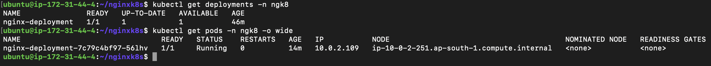

## DevOps Assignemnt 1

##### 1. Create a Nginx deployment with 3 replicas

Refer file deployment_nginx.yaml

##### 2. Create a service

Refer file service_nginx.yaml

##### 3.  Access the ngnix deployment via the browser

##### 4. Update replica size in reducing order from 3 to 0 and then set it to 1

##### 5. Enter the ngnix pod and access it from there using the service

##### 6. View logs of the pod

##### 7. View the pod and deployment status

##### 8.
